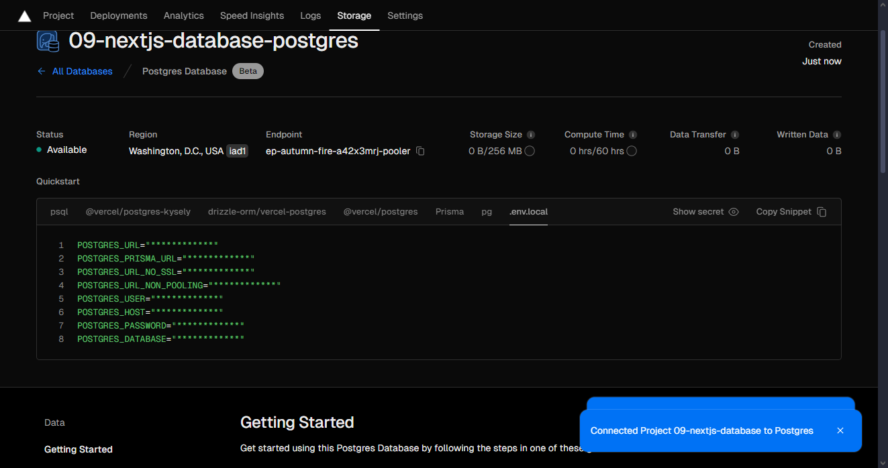
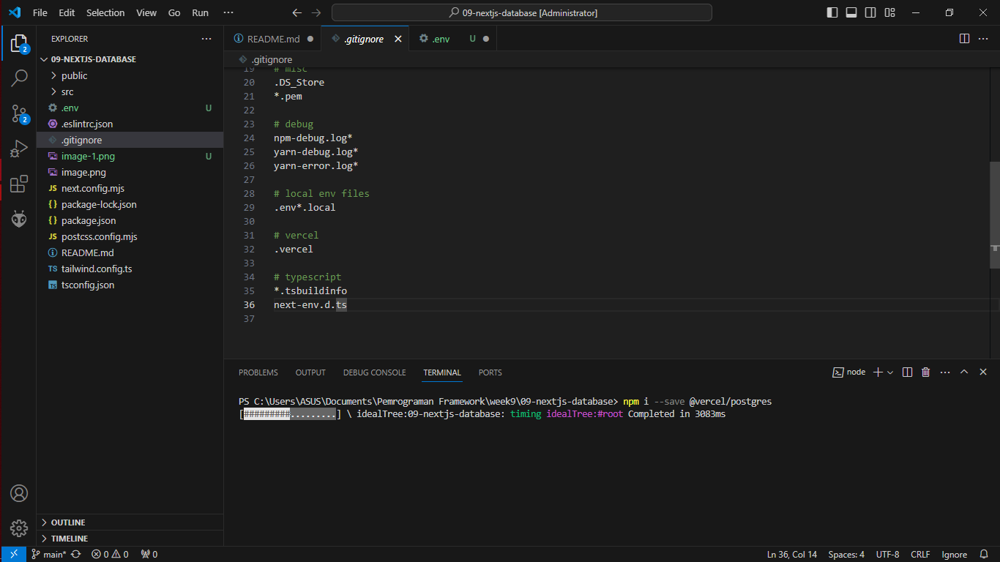
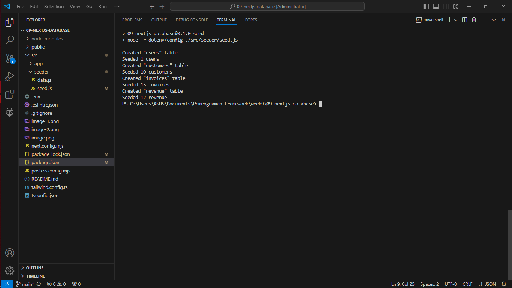
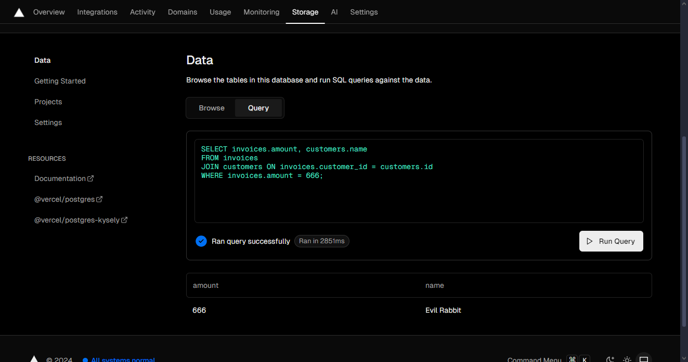
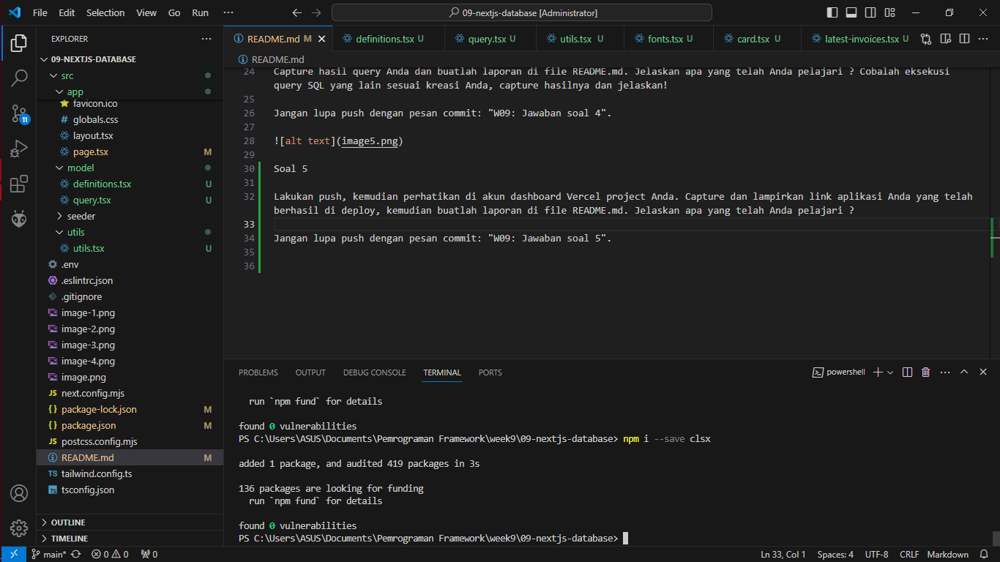
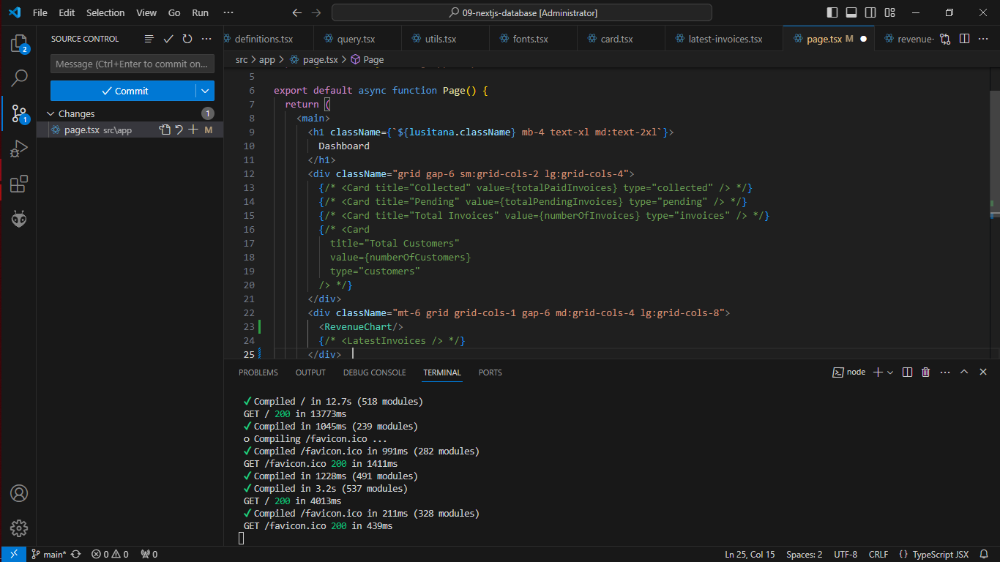

Soal 1
Capture hasil deploy project Anda dan buatlah laporan di file README.md. Jelaskan apa yang telah Anda pelajari?

Jangan lupa push dengan pesan commit: "W09: Jawaban soal 1".

Soal 2
Capture hasil basis data Anda dan buatlah laporan di file README.md. Jelaskan apa yang telah Anda pelajari?

Jangan lupa push dengan pesan commit: "W09: Jawaban soal 2".

Soal 3 
Capture hasil npm run seed Anda dan buatlah laporan di file README.md. Jelaskan apa yang telah Anda pelajari ?

Jangan lupa push dengan pesan commit: "W09: Jawaban soal 3".

Soal 4
Capture hasil query Anda dan buatlah laporan di file README.md. Jelaskan apa yang telah Anda pelajari ? Cobalah eksekusi query SQL yang lain sesuai kreasi Anda, capture hasilnya dan jelaskan!

Jangan lupa push dengan pesan commit: "W09: Jawaban soal 4".

Soal 5

Lakukan push, kemudian perhatikan di akun dashboard Vercel project Anda. Capture dan lampirkan link aplikasi Anda yang telah berhasil di deploy, kemudian buatlah laporan di file README.md. Jelaskan apa yang telah Anda pelajari ?

Jangan lupa push dengan pesan commit: "W09: Jawaban soal 5".

Link Domain :
