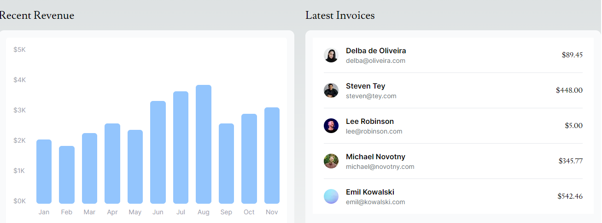
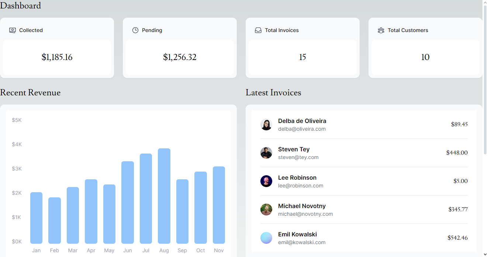

Soal 1
Capture hasil deploy project Anda dan buatlah laporan di file README.md. Jelaskan apa yang telah Anda pelajari?

Jangan lupa push dengan pesan commit: "W09: Jawaban soal 1".

Soal 2
Capture hasil basis data Anda dan buatlah laporan di file README.md. Jelaskan apa yang telah Anda pelajari?

Jangan lupa push dengan pesan commit: "W09: Jawaban soal 2".

Soal 3 
Capture hasil npm run seed Anda dan buatlah laporan di file README.md. Jelaskan apa yang telah Anda pelajari ?

Jangan lupa push dengan pesan commit: "W09: Jawaban soal 3".

Soal 4
Capture hasil query Anda dan buatlah laporan di file README.md. Jelaskan apa yang telah Anda pelajari ? Cobalah eksekusi query SQL yang lain sesuai kreasi Anda, capture hasilnya dan jelaskan!

Jangan lupa push dengan pesan commit: "W09: Jawaban soal 4".

Soal 5

Lakukan push, kemudian perhatikan di akun dashboard Vercel project Anda. Capture dan lampirkan link aplikasi Anda yang telah berhasil di deploy, kemudian buatlah laporan di file README.md. Jelaskan apa yang telah Anda pelajari ?

Jangan lupa push dengan pesan commit: "W09: Jawaban soal 5".

Link Domain :https://09-nextjs-database-tau.vercel.app/

Soal 6
Lakukan capture dan push hasilnya, kemudian buatlah laporan di file README.md. Jelaskan apa yang telah Anda pelajari ?

Jangan lupa push dengan pesan commit: "W09: Jawaban soal 6".

Soal 7
Lakukan capture dan push hasilnya, kemudian buatlah laporan di file README.md. Jelaskan apa yang telah Anda pelajari ?

Jangan lupa push dengan pesan commit: "W09: Jawaban soal 7".

Tugas Praktikum

Jika Anda perhatikan pada file src\app\page.tsx untuk komponen Card sebenarnya telah dibuat sebagai molecules pada file src\app\components\molecules\card.tsx yaitu komponen CardWrapper. Silakan Anda sesuaikan sehingga dapat tampil seperti gambar berikut.

Perhatikan fungsi fetchCardData() (pada file src\model\query.tsx) dari soal nomor 1. Jelaskan maksud kode dan kueri yang dilakukan dalam fungsi tersebut!
jawaban :
Fungsi fetchCardData() adalah untuk mengambil  data statistik yang user akan ditampilkan pada dashboard aplikasi. Data  yang diambil antara lain adalah :
jumlah total invoice
jumlah total pelanggan
total jumlah invoice yang telah dibayar 
total jumlah invoice yang masih pending.